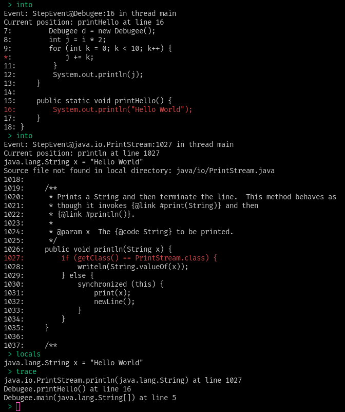

# Simple Command Line Debugger (JDI)

## Usage

1.  `javac -g Debugee.java`
2. launch debugger
3. input command "launch Debugee"
4. use "help" to list other commands

## Example

launching:

breakpoints:

stepping, locals, and stack trace:

other step commands:

continue to breakpoint:

